# Registro de testes de software

Pré-requisitos: <a href="05-Projeto-interface.md"> Projeto de interface</a>, <a href="08-Plano-testes-software.md"> Plano de testes de software</a>

Relatório com as evidências dos testes de software realizados no sistema pela equipe, baseado em um plano de testes pré-definido.

Para cada caso de teste definido no <a href="08-Plano-testes-software.md"> Plano de testes de software</a>, realize o registro das evidências dos testes feitos na aplicação pela equipe, que comprovem que o critério de êxito foi alcançado (ou não!). Para isso, utilize uma ferramenta de captura de tela que mostre cada um dos casos de teste definidos. Observação: cada caso de teste deverá possuir um vídeo do tipo _screencast_ para caracterizar uma evidência do referido caso.

|  **Cadastro malsucedido:** |
 

| **Cadastro malsucedido senha fraca:** |
 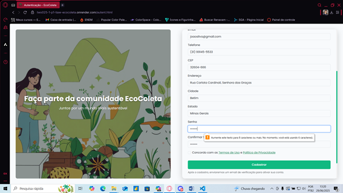

| **Cadastro bem-sucedido:** |
 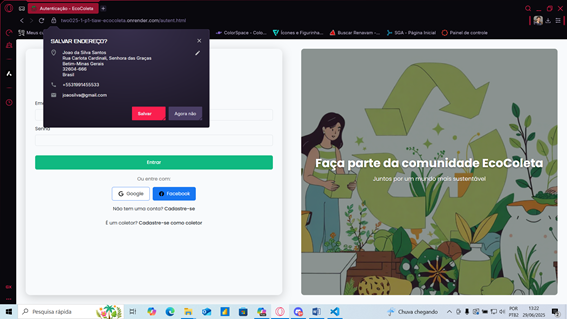

| **Teste login malsucedido:** |
 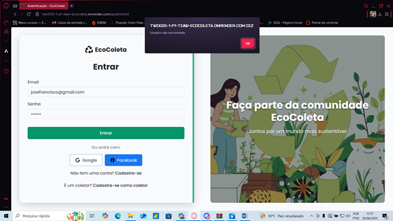

| **Teste login bem-sucedido:** |
 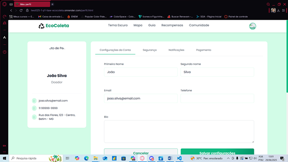

| **Calcule impacto Plástico:** |
 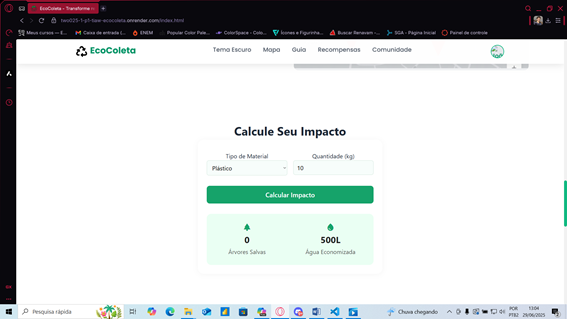

| **Calcule impacto Vidro:** |
 

| **Calcule impacto Papel:** |
 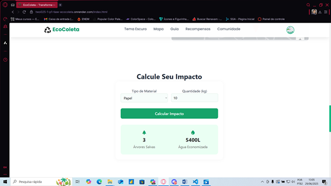
 
| **Calcule impacto Metal:** |
 

 | **Recompensas - Versão Coletor** |
 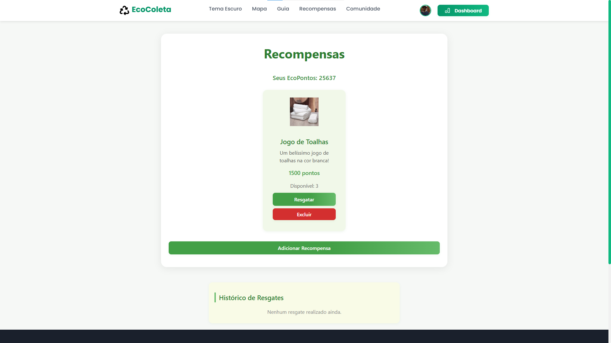

 | **Recompensas - Versão Coletor - Nova Recompensa** |
 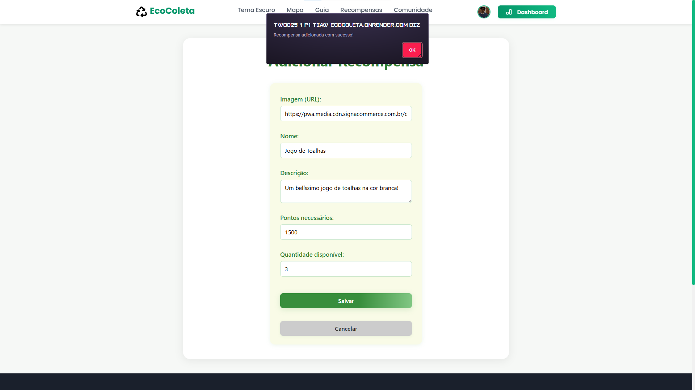

**Recompensas - Usuário comum - Ponto insuficiente**
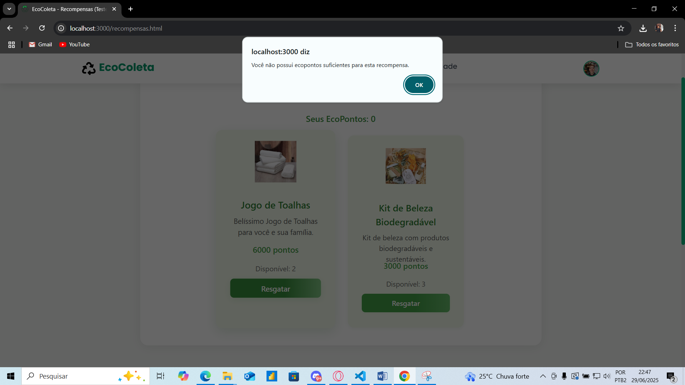

**Recompensas - Usuário comum - Ponto suficiente**
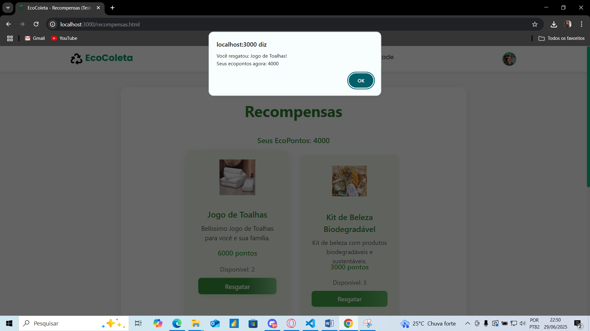

**Recompensa indisponível - usuário comum**
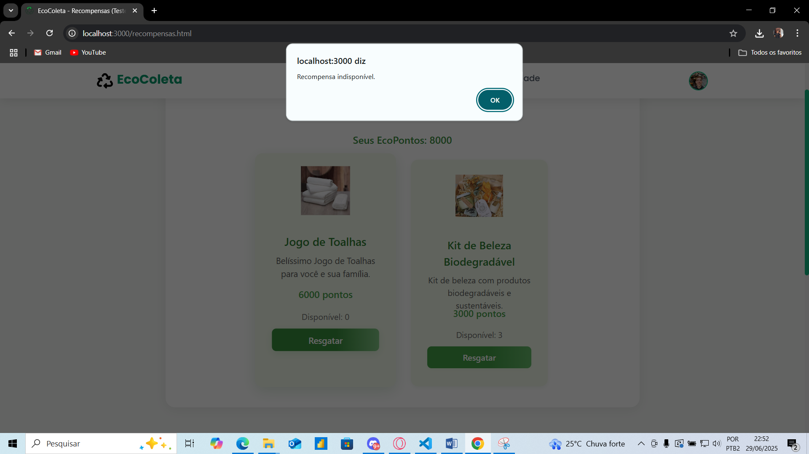

| **Agendamento indisponível:** |
 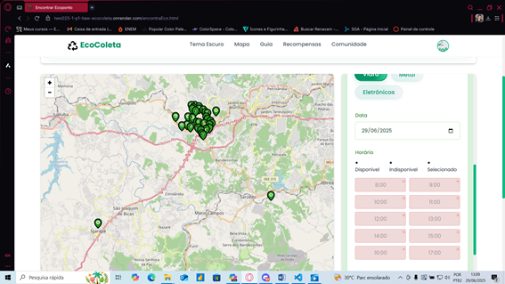

| **Agendamento disponível:** |
 

| **Agentamento sem material** |
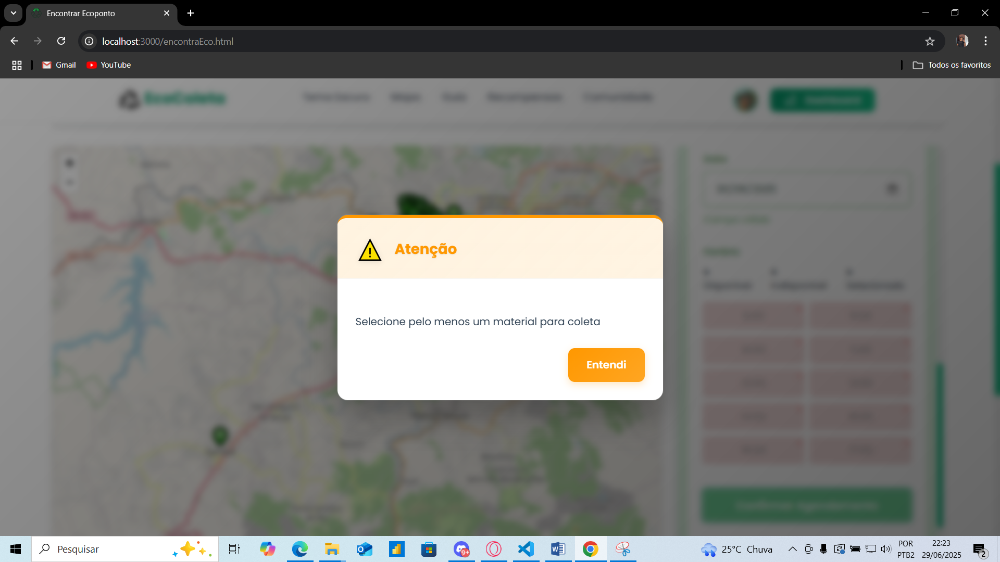

| **Agendamento concluído:** |
 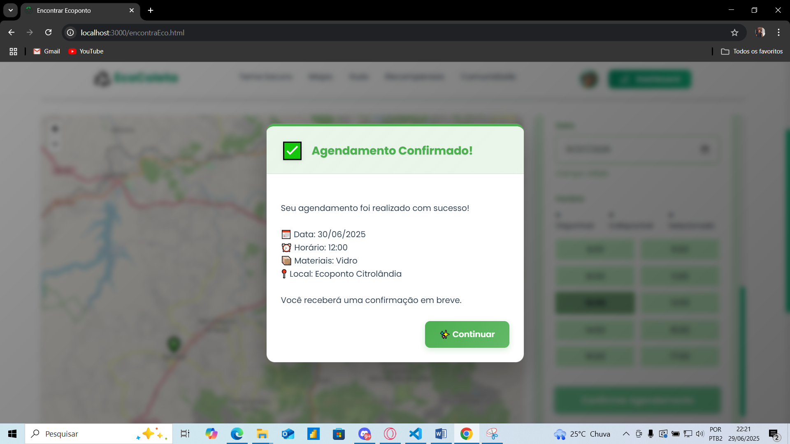

| **Quiz resposta correta:** |
 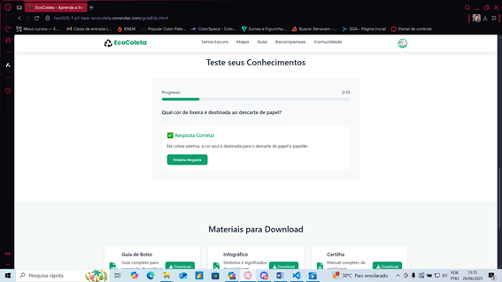

| **Quiz resposta errada:** |
 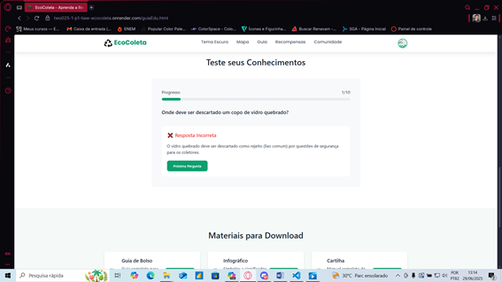

| **Doações - Usuário comum**

**Dashboard para coletores**

**Exportando Arquivos**
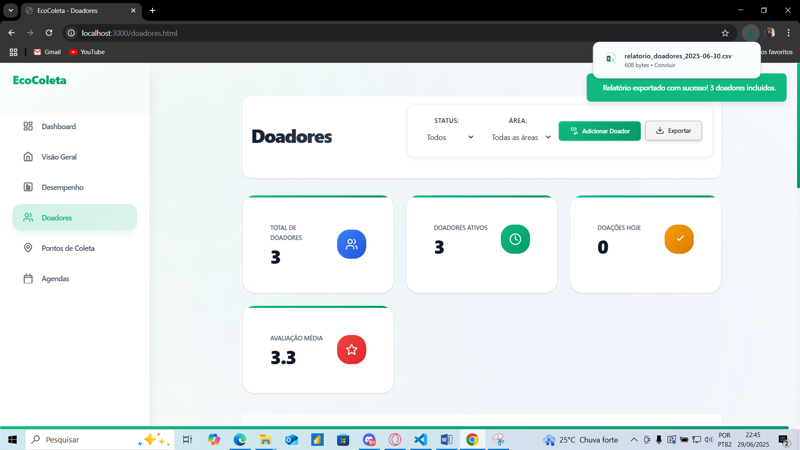

**Comunidades**
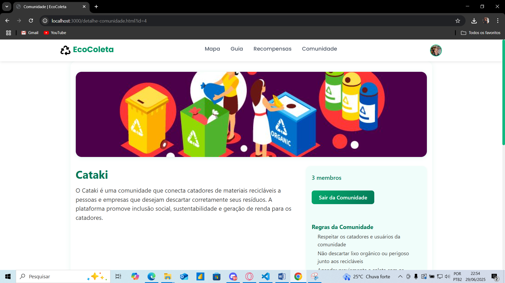

**Comentários em públicações da comunidade**
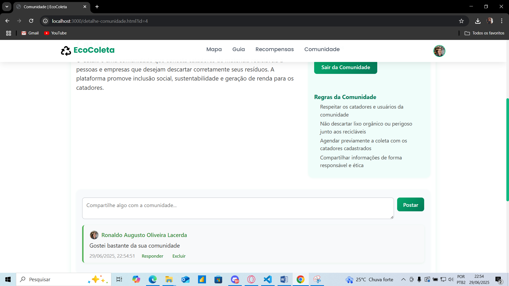

**Saindo da comunidade**
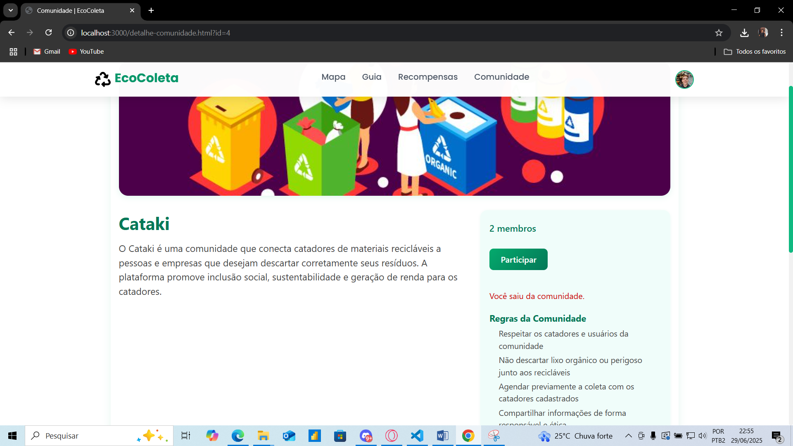

**Downloads de materiais de apoio**
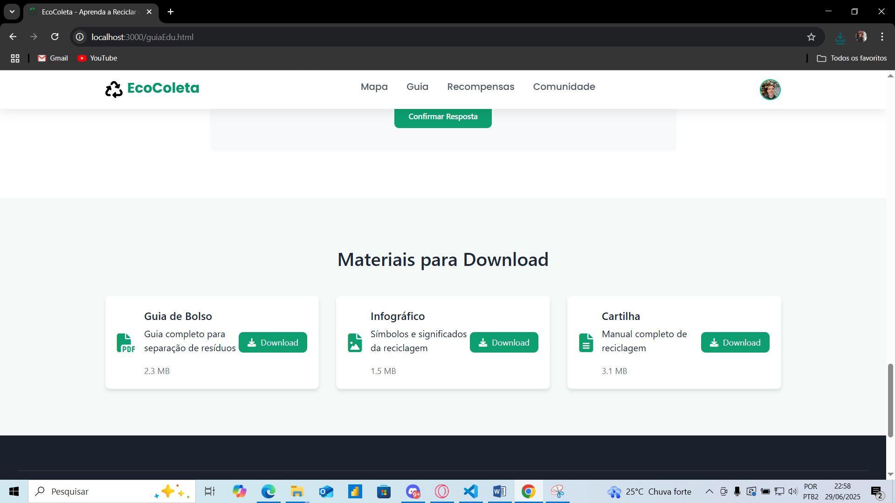

**Downloads realizado - materiais de apoio**
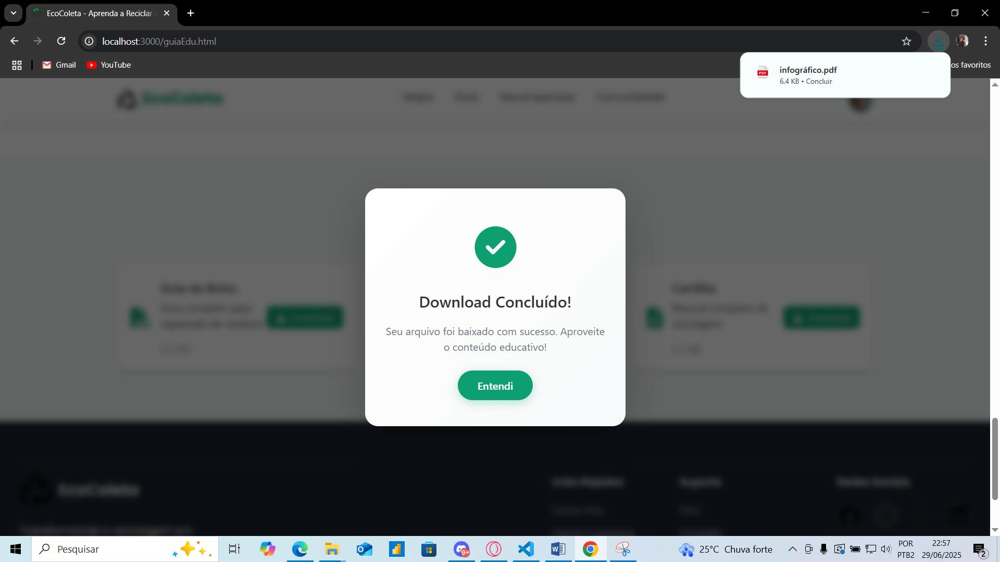
> **Links úteis**:
> - [Screencast: entenda o que é e como gravar vídeos com ele](https://rockcontent.com/br/blog/screencast/) 

## Avaliação

Discorra sobre os resultados do teste, ressaltando os pontos fortes e fracos identificados na solução. Comente como o grupo pretende abordar esses pontos nas próximas iterações. Apresente as falhas detectadas e as melhorias geradas a partir dos resultados obtidos nos testes.

> **Links úteis**:
> - [Ferramentas de Teste para JavaScript](https://geekflare.com/javascript-unit-testing/)
