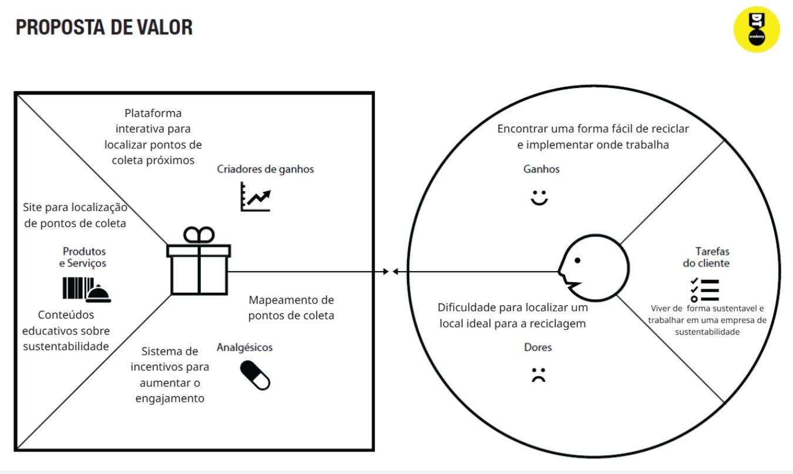
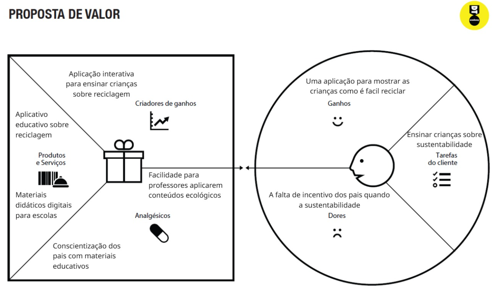
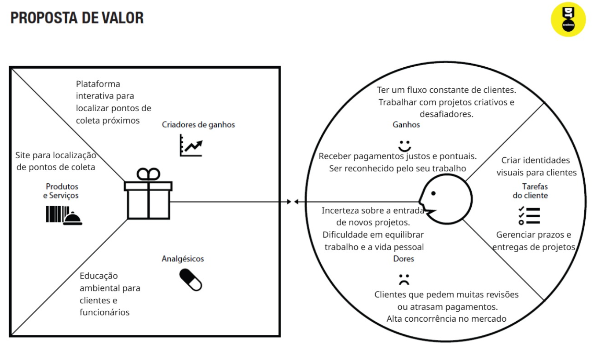

# Product design

Pré-requisitos: <a href="02-Product-discovery.md"> Product discovery</a>

## Histórias de usuários

Com base na análise das personas, foram identificadas as seguintes histórias de usuários:

|EU COMO................................| QUERO/PRECISO .................... |PARA ................................ |
|Cidadão preocupado com o meio ambiente | Localizar pontos de coleta seletiva próximos a mim | Descartar meus resíduos corretamente |
|Usuário do sistema | Trocá-los por benefícios sustentáveis | Acumular pontos ao reciclar materiais |
|Administrador da plataforma| Visualizar estatísticas de reciclagem | Monitorar e melhorar o impacto ambiental  |
|Cidadão sem conhecimento sobre reciclagem  |Acessar informações sobre descarte correto  | Aprender a reciclar de forma eficiente  |
|Incentivar práticas sustentáveis e fortalecer minha marca| Empresa parceira  |Oferecer descontos e benefícios aos usuários que reciclam  |
|Membro da comunidade | Interagir com outras pessoas interessadas em sustentabilidade | Trocar experiências e ampliar meu impacto ambiental |

## Proposta de valor

**✳️✳️✳️ APRESENTE O DIAGRAMA DA PROPOSTA DE VALOR PARA CADA PERSONA ✳️✳️✳️**

Propostas de valor:
![(images/Proposta-de-Valor1.jpg)]
![(images/Proposta-de-Valor1.jpg)]
![(images/Proposta-de-Valor1.jpg)]

## Requisitos

As tabelas a seguir apresentam os requisitos funcionais e não funcionais que detalham o escopo do projeto. Para determinar a prioridade dos requisitos, aplique uma técnica de priorização e detalhe como essa técnica foi aplicada.

### Requisitos funcionais

| 001| - O sistema deve permitir que os usuários encontrem pontos de coleta seletiva próximos | ALTA      |
| 002| - A plataforma precisa exibir estatísticas de reciclagem.                              | MÉDIA     |
| 003| - O usuário deve conseguir registrar materiais reciclados e acumular pontos.           | BAIXA     |

### Requisitos não funcionais

| 001| - O site deve ser responsivo e acessível em dispositivos móveis                  | ALTA      |
| 002| - O tempo de resposta para carregamento de mapas deve ser inferior a 3 segundos. | MÉDIA     |
| 003| - O sistema deve estar disponível 24/7.                                          | ALTA      |

> **Links úteis**:
> - [O que são requisitos funcionais e requisitos não funcionais?](https://codificar.com.br/requisitos-funcionais-nao-funcionais/)
> - [Entenda o que são requisitos de software, a diferença entre requisito funcional e não funcional, e como identificar e documentar cada um deles](https://analisederequisitos.com.br/requisitos-funcionais-e-requisitos-nao-funcionais-o-que-sao/)

## Restrições

Enumere as restrições à sua solução. Lembre-se de que as restrições geralmente limitam a solução candidata.

O projeto está restrito aos itens apresentados na tabela a seguir.

|ID| Restrição                                             |
|--|-------------------------------------------------------|
|001| O projeto deverá ser entregue até o final do semestre      | ALTA  |
|002| Não é permitido o desenvolvimento de um módulo de back-end | ALTA  |