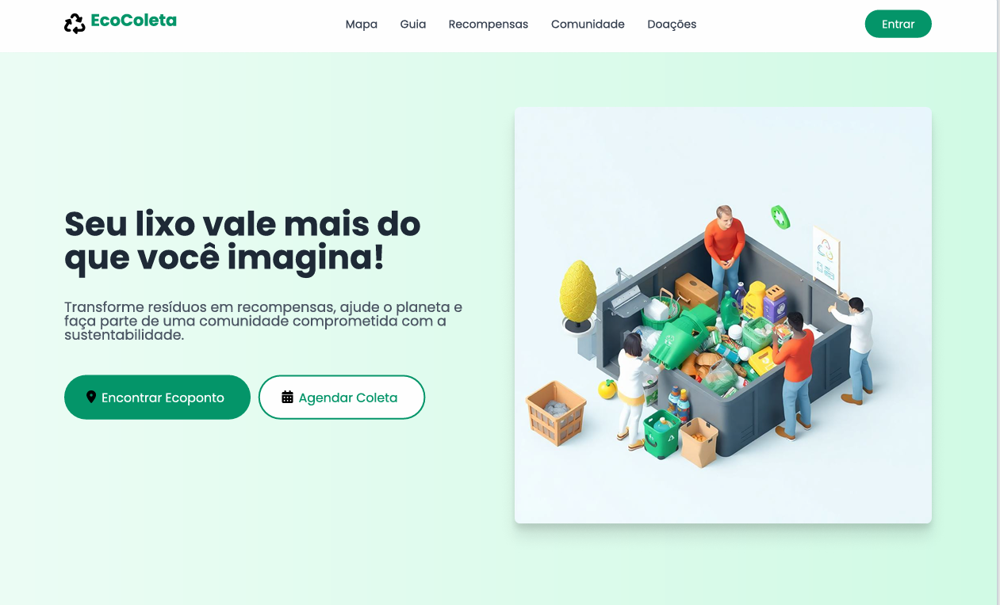
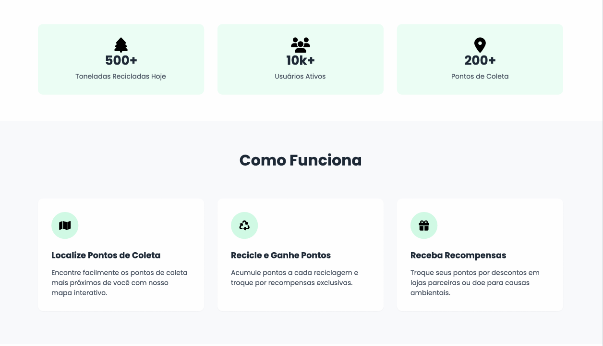
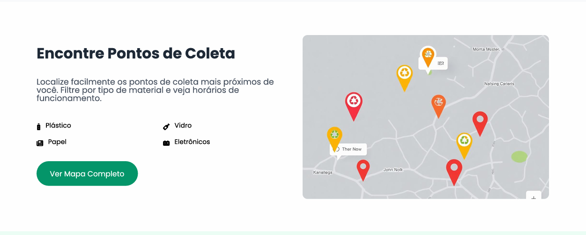
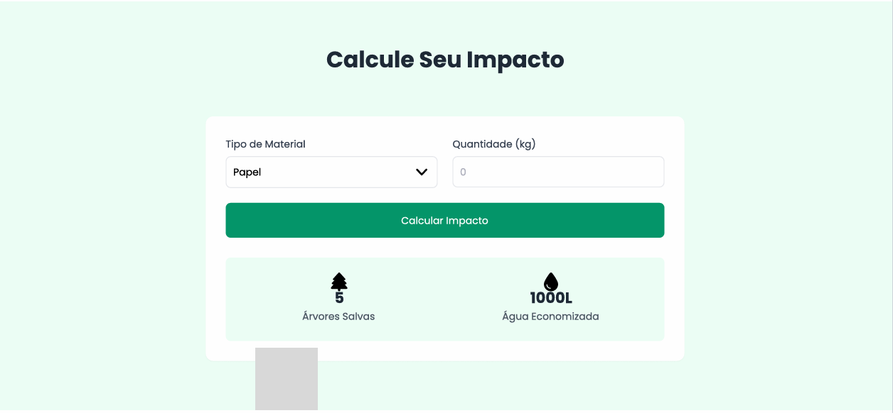
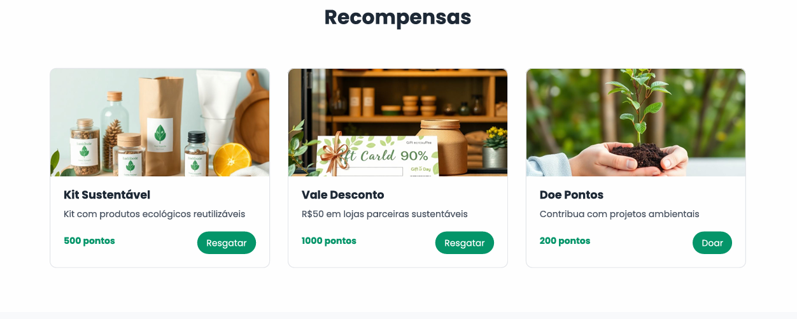
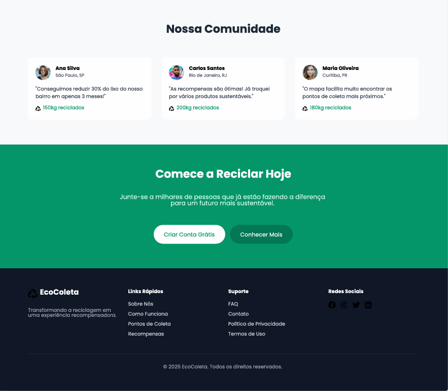

# Template padrão da aplicação

Pré-requisitos: <a href="03-Product-design.md"> Especificação do projeto</a>, <a href="04-Metodologia.md"> Metodologia</a>, <a href="05-Projeto-interface.md"> Projeto de interface</a>

Layout padrão da aplicação que será utilizado em todas as páginas com a definição de identidade visual, aspectos de responsividade e iconografia.

# Explicacao da logo 

A logo do nosso projeto EcoColeta foi cuidadosamente pensada para comunicar de forma clara e impactante a nossa missão e os valores que nos movem. Cada elemento tem um propósito:

O Símbolo Universal de Reciclagem: Este é o coração da nossa logo. As três setas que formam um ciclo representam a essência da nossa causa: o ciclo da reciclagem – reduzir, reutilizar e reciclar. Ele simboliza o movimento contínuo dos materiais, que deixam de ser lixo para se transformar em novos recursos. É um ícone reconhecido globalmente, que imediatamente conecta o observador ao nosso compromisso com a sustentabilidade e o meio ambiente.

O Nome 'EcoColeta': A escolha do nome é intencional e direta.

'Eco' remete diretamente à ecologia, ao equilíbrio ambiental e à conscientização. É a nossa bandeira verde, indicando que tudo o que fazemos é pensando no bem do nosso planeta.

'Coleta' expressa a ação prática e fundamental do nosso projeto: a recolha organizada de materiais recicláveis. É o elo entre a intenção de reciclar e a sua efetivação.

As Cores (Verde e Preto):

O verde vibrante no nome 'EcoColeta' é a cor da natureza, da esperança, da vida e da renovação. Ele reforça nossa conexão com o meio ambiente e o futuro que queremos construir através da reciclagem.

O preto sólido no símbolo de reciclagem confere seriedade, força e destaque. Ele garante que o ícone principal seja visível e memorável, transmitindo a importância da nossa causa.

A Tipografia Simples e Clara: Optamos por uma fonte limpa e de fácil leitura para garantir que a mensagem seja transmitida sem ruídos. A simplicidade e a legibilidade da tipografia refletem a nossa busca por soluções descomplicadas e acessíveis para a comunidade.

Em conjunto, todos esses elementos formam uma identidade visual que não só explica o que fazemos, mas também inspira e convida a comunidade a fazer parte dessa onda de conscientização e ação em prol de um futuro mais sustentável para todos."

# fotos do projeto demostrando o layout

