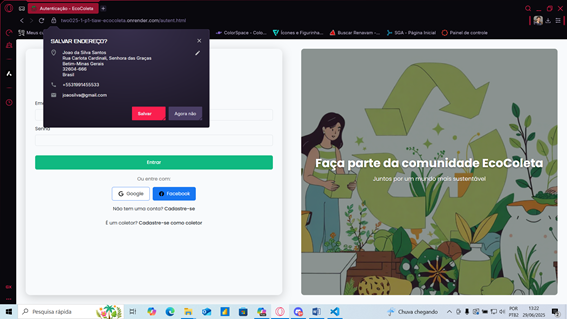
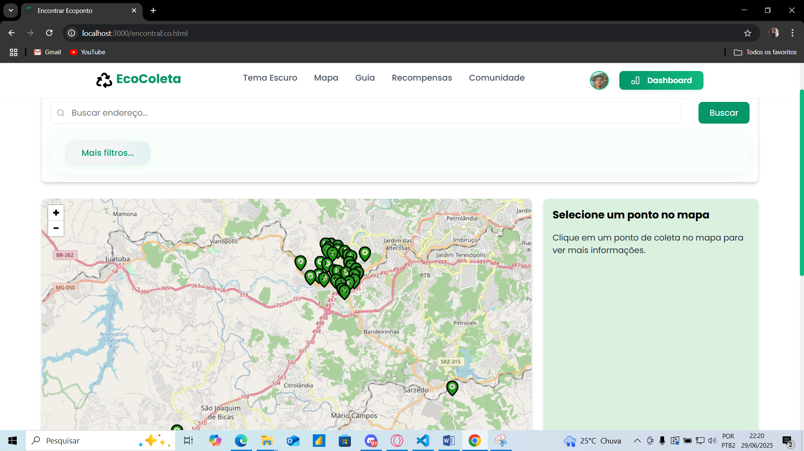
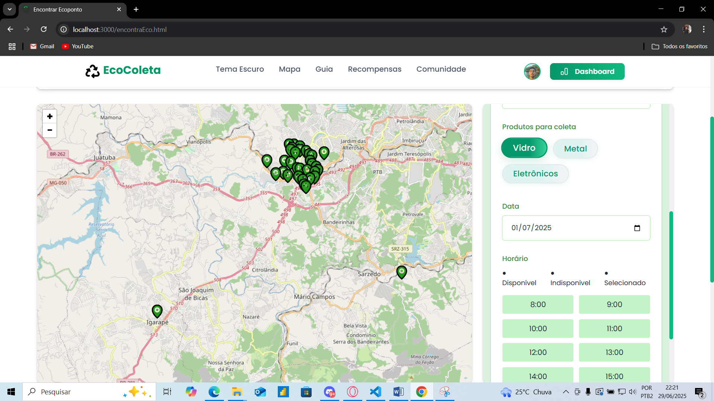
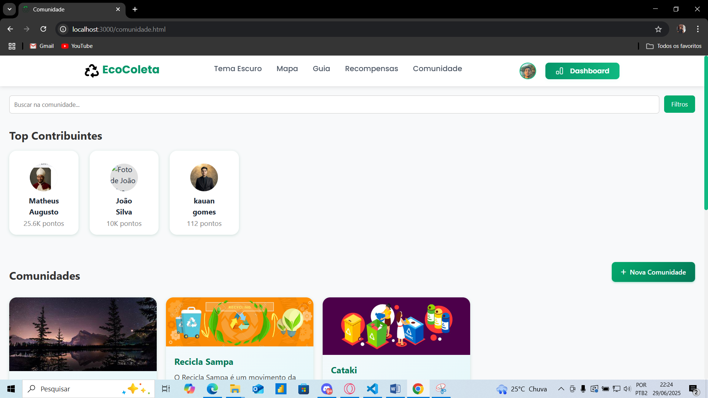

# Arquitetura da solução

Pré-requisitos: <a href="05-Projeto-interface.md"> Projeto de interface</a>

Definição de como o software é estruturado em termos dos componentes que fazem parte da solução e do ambiente de hospedagem da aplicação.

## Funcionalidades

Esta seção apresenta as funcionalidades da solução.

##### Funcionalidade 1 - Cadastro de Usuários

Permite a inclusão, leitura, alteração e exclusão de usuários para o sistema

* **Estrutura de dados:** Usuário
* **Instruções de acesso:**
  * Abra o site e efetue o cadastro;
  * Acesse o menu principal e escolha a opção "Com a imagem do avatar";
* **Tela da funcionalidade**:

### Estruturas de dados

Guarda as informações do cadastro e login do usuário.

##### Estrutura de dados - Dados do usuário

Estrutura de dados do usuário:

  "usuarios": [
    {
      "id": 1,
      "nome": "João Silva",
      "email": "joao.silva@email.com",
      "senha": "123456",
      "cpf": "123.456.789-00",
      "telefone": "11 99999-9999",
      "endereco": "Rua das Flores, 123 - Centro, Betim - MG",
      "dataNascimento": "1990-01-01",
      "tipoUsuario": "doador",
      "ecopontos": 10000,
      "imagem": "https://cdn.builder.io/api/v1/image/assets/4c6f6ec200514327a30a7409483092ac/0f6c0c0c0c0c0c0c0c0c0c0c0c0c0c0c0c0c0c0c"
    }
  ]
##### Funcionalidade 2 - Cadastro de Ecopontos

Permite a inclusão, leitura, alteração e exclusão de ecopontos no sistema.

* **Estrutura de dados:** Ecoponto
* **Instruções de acesso:**
  * Acesse o menu principal e selecione "Ecopontos";
  * Clique em "Adicionar Ecoponto" para cadastrar um novo local;
* **Tela da funcionalidade**:

### Estruturas de dados

Guarda as informações dos ecopontos cadastrados.

##### Estrutura de dados - Dados do ecoponto

Estrutura de dados do ecoponto:

  "ecopontos": [
    {
      "id": 1,
      "nome": "Ecoponto Central",
      "endereco": "Av. Principal, 500 - Centro, Betim - MG",
      "horarioFuncionamento": "08:00 às 18:00",
      "materiaisAceitos": ["papel", "plástico", "vidro"],
      "responsavel": "Maria Souza",
      "telefone": "31 98888-8888"
    }
  ]

---

##### Funcionalidade 3 - Cadastro de Doações

Permite registrar doações de materiais recicláveis feitas pelos usuários.

* **Estrutura de dados:** Doação
* **Instruções de acesso:**
  * Faça login no sistema;
  * Acesse o menu "Doações" e clique em "Nova Doação";
* **Tela da funcionalidade**:

### Estruturas de dados

Guarda as informações das doações realizadas.

##### Estrutura de dados - Dados da doação

Estrutura de dados da doação:

  "doacoes": [
    {
      "id": 1,
      "usuarioId": 1,
      "ecopontoId": 1,
      "data": "2025-06-29",
      "materiais": [
        {"tipo": "papel", "quantidadeKg": 2},
        {"tipo": "plástico", "quantidadeKg": 1}
      ],
      "ecopontosGerados": 300
    }
  ]

---

##### Funcionalidade 4 - Ranking de Usuários

Exibe um ranking dos usuários que mais doaram materiais recicláveis.

* **Estrutura de dados:** Usuário
* **Instruções de acesso:**
  * Acesse o menu "Ranking";
* **Tela da funcionalidade**:

### Estruturas de dados

Utiliza os dados dos usuários e suas doações para gerar o ranking.

##### Estrutura de dados - Ranking

Exemplo de estrutura de dados para o ranking:

  "ranking": [
    {
      "usuarioId": 1,
      "nome": "João Silva",
      "ecopontos": 10000
    },
    {
      "usuarioId": 2,
      "nome": "Maria Souza",
      "ecopontos": 8500
    }
  ]
### Módulos e APIs
Fontes:

Font Awesome (https://fontawesome.com/)
Scripts:
jQuery (https://jquery.com/)
Bootstrap (https://getbootstrap.com/)
GSAP (https://gsap.com/)
ScrollReveal (revealjs.org)

**Fonts:**

* Fonte awesome - https://fontawesome.com/

**Scripts:**

* jQuery - https://jquery.com/
* Bootstrap - https://getbootstrap.com/
* GSAP - https://gsap.com/
* ScrollReveal - revealjs.org 

## Hospedagem

Utilizamos o render como hospedagem para o site.

> **Links úteis**:
> - [Website com GitHub Pages](https://pages.github.com/)
> - [Programação colaborativa com Repl.it](https://repl.it/)
> - [Getting started with Heroku](https://devcenter.heroku.com/start)
> - [Publicando seu site no Heroku](http://pythonclub.com.br/publicando-seu-hello-world-no-heroku.html)
