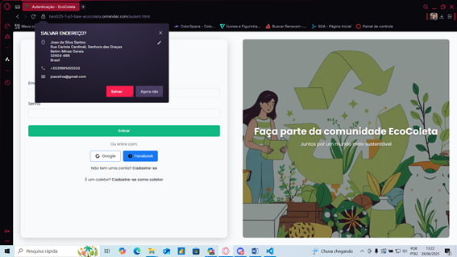
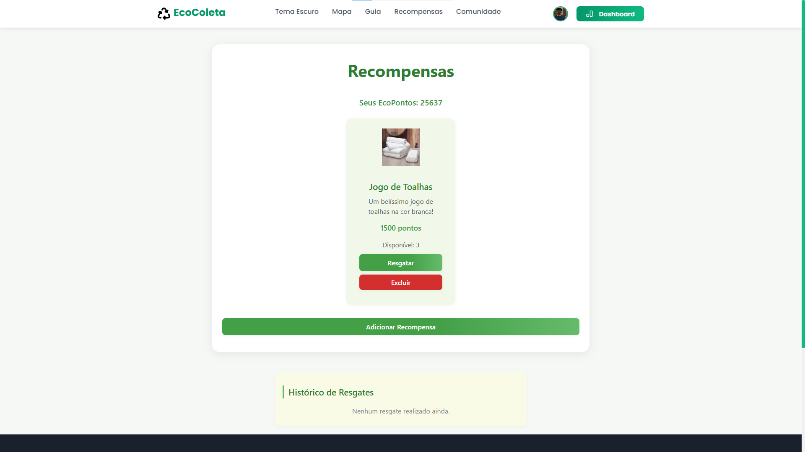
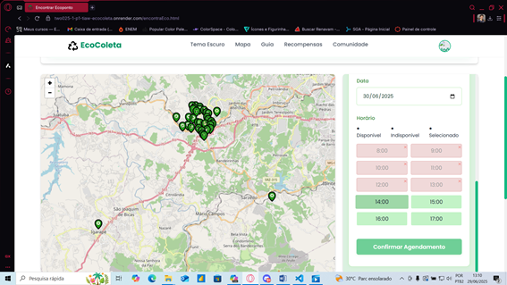
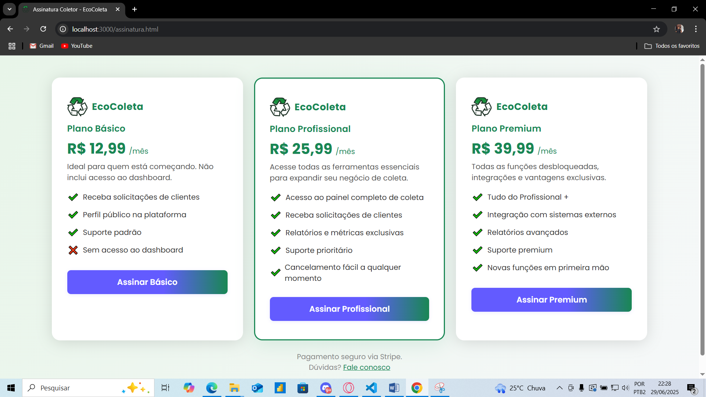
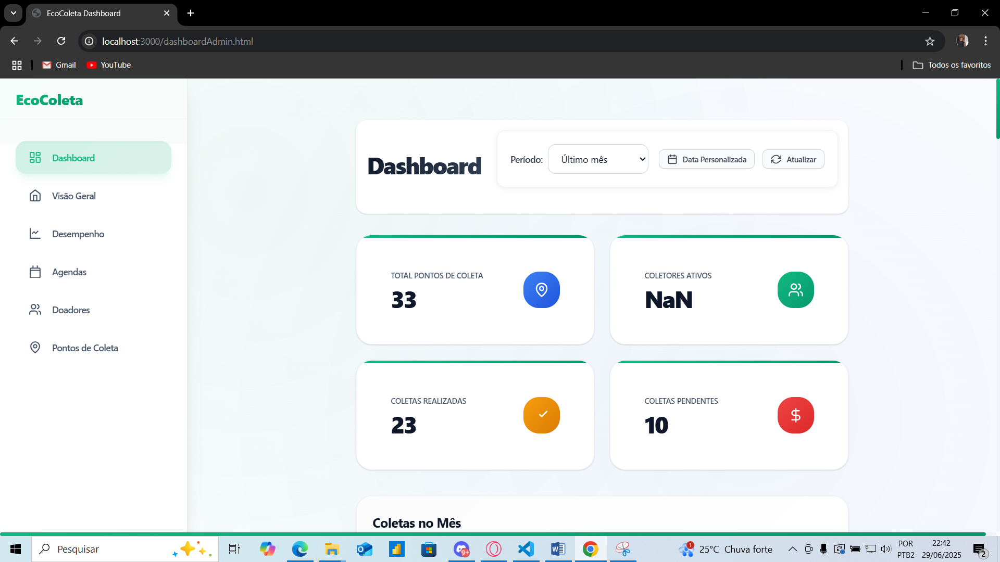
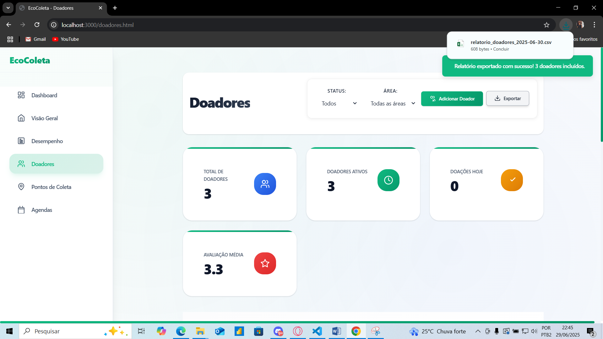

# Registro de testes de software

Pré-requisitos: <a href="05-Projeto-interface.md"> Projeto de interface</a>, <a href="08-Plano-testes-software.md"> Plano de testes de software</a>

Relatório com as evidências dos testes de software realizados no sistema pela equipe, baseado em um plano de testes pré-definido.

Para cada caso de teste definido no <a href="08-Plano-testes-software.md"> Plano de testes de software</a>, realize o registro das evidências dos testes feitos na aplicação pela equipe, que comprovem que o critério de êxito foi alcançado (ou não!). Para isso, utilize uma ferramenta de captura de tela que mostre cada um dos casos de teste definidos. Observação: cada caso de teste deverá possuir um vídeo do tipo _screencast_ para caracterizar uma evidência do referido caso.

|  **Cadastro malsucedido:** |
 

| **Cadastro malsucedido senha fraca:** |
 

| **Cadastro bem-sucedido:** |
 

| **Teste login malsucedido:** |
 

| **Teste login bem-sucedido:** |
 

| **Calcule impacto Plástico:** |
 

| **Calcule impacto Vidro:** |
 

| **Calcule impacto Papel:** |
 
 
| **Calcule impacto Metal:** |
 

 | **Recompensas - Versão Coletor** |
 

 | **Recompensas - Versão Coletor - Nova Recompensa** |
 

**Recompensas - Usuário comum - Ponto insuficiente**

**Recompensas - Usuário comum - Ponto suficiente**

**Recompensa indisponível - usuário comum**

| **Agendamento indisponível:** |
 

| **Agendamento disponível:** |
 

| **Agentamento sem material** |

| **Agendamento concluído:** |
 

| **Quiz resposta correta:** |
 

| **Quiz resposta errada:** |
 

| **Doações - Usuário comum**

**Dashboard para coletores**

**Exportando Arquivos**

**Comunidades**

**Comentários em públicações da comunidade**

**Saindo da comunidade**

**Downloads de materiais de apoio**

**Downloads realizado - materiais de apoio**

## Avaliação

A fase de testes revelou uma solução com potencial significativo, destacando-se pela funcionalidade robusta da maioria dos recursos implementados. Nosso projeto demonstra ter todas as funcionalidades essenciais e úteis que foram planejadas, o que representa um grande ponto forte. A usabilidade geral do sistema também se mostrou satisfatória, indicando uma boa base para as próximas etapas de desenvolvimento.

Pontos Fracos e Melhorias Propostas
Apesar dos êxitos, os testes também identificaram oportunidades de aprimoramento que serão abordadas nas próximas iterações. As principais falhas detectadas incluem:

Erros de software (bugs): Diversos bugs foram identificados, tanto a nível visual quanto funcional. Estes impactam a experiência do usuário e a estabilidade do sistema.

Integração com API de Pagamento (Stripe): A funcionalidade de integração com a API da Stripe, por ser recém-implementada, apresentou alguns erros específicos, necessitando de ajustes para garantir transações fluidas e confiáveis.

Consistência Visual: Foram observadas inconsistências visuais, como a falta de padronização nos ícones apresentados no dashboard, o que afeta a coesão da interface do usuário.

Plano de Ação para Próximas Iterações
Para abordar os pontos fracos identificados e otimizar a solução, nosso grupo planeja as seguintes ações nas próximas iterações:

    Priorização e Correção de Bugs: Mapearemos e priorizaremos todos os bugs visuais e funcionais detectados para correção imediata, garantindo a estabilidade e confiabilidade do sistema.

    Refinamento da Integração Stripe: Dedicaremos esforços para depurar e otimizar a integração com a API de pagamento da Stripe, assegurando que todas as operações relacionadas ao dashboard e transações ocorram sem falhas.

    Padronização da Interface do Usuário (UI): Realizaremos uma revisão completa da interface, com foco na padronização de elementos visuais, como ícones, para garantir uma experiência de usuário mais coesa e profissional.

Essas ações visam não apenas corrigir as falhas atuais, mas também aprimorar a qualidade geral da solução, solidificando seus pontos fortes e garantindo um produto final robusto e de alta qualidade.
