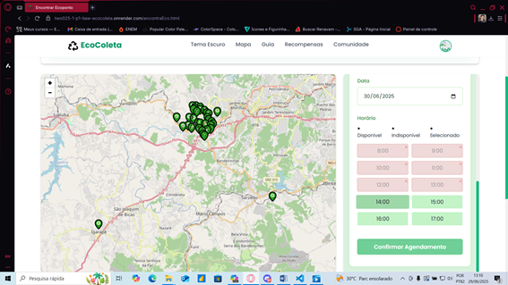
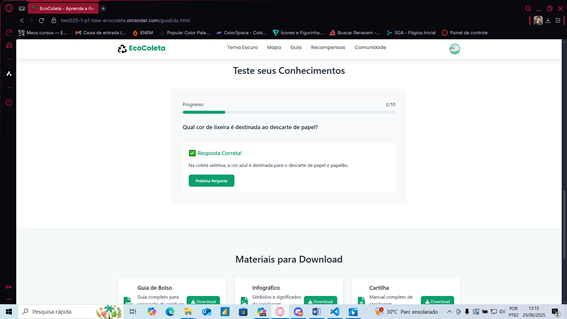
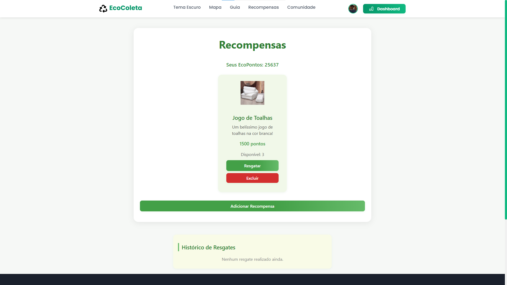
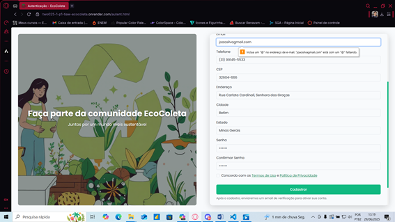
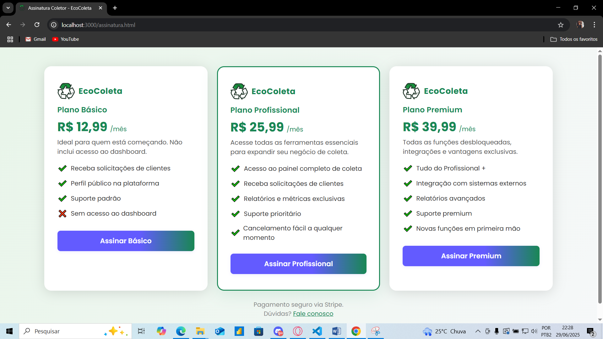
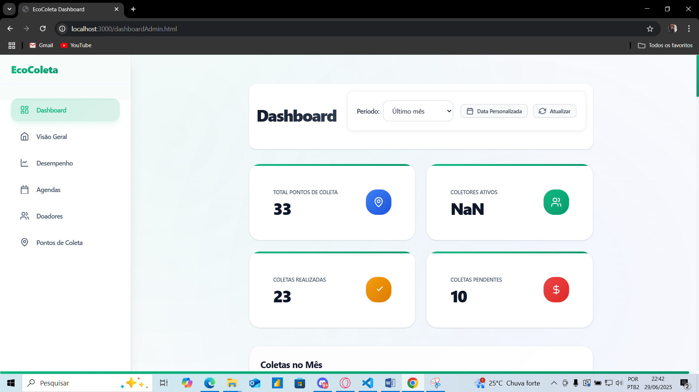
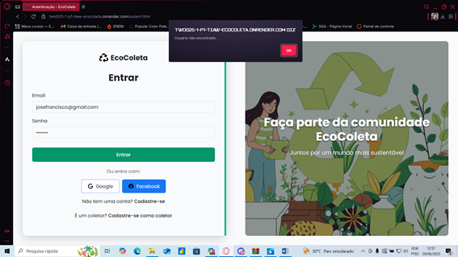
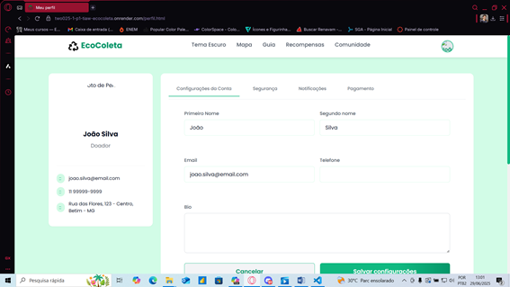
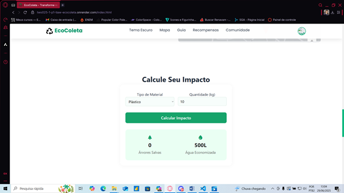

# Apresentação do projeto

Pré-requisitos: Todos os demais artefatos

  
  
  
  
  
  
  
  
  
  

## Slides

[Clique aqui para acessar os slides do projeto (PDF)](../docs/Ecocoleta.pdf)

## Vídeo

Ou assista diretamente no YouTube: [https://youtu.be/cra6x3IxhD8](https://youtu.be/cra6x3IxhD8)

